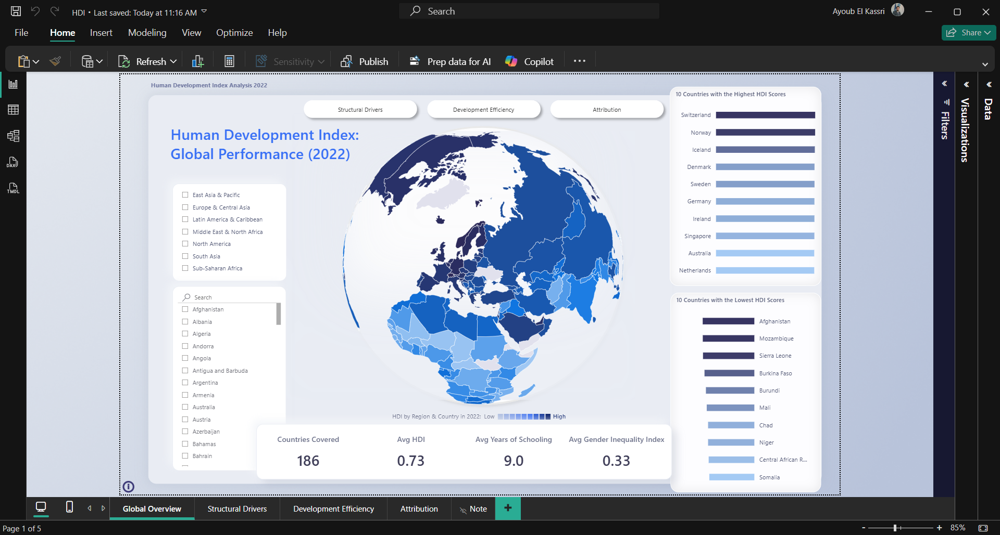
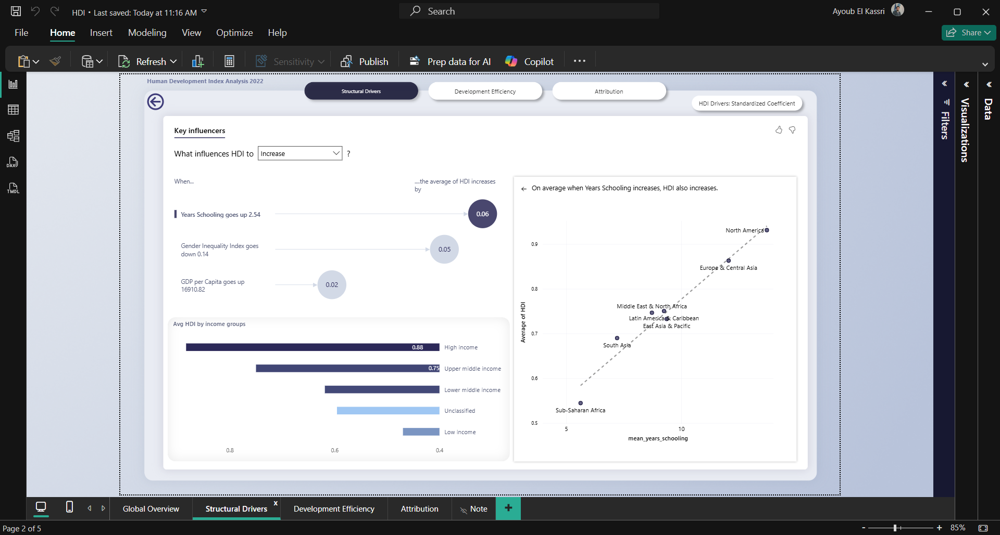
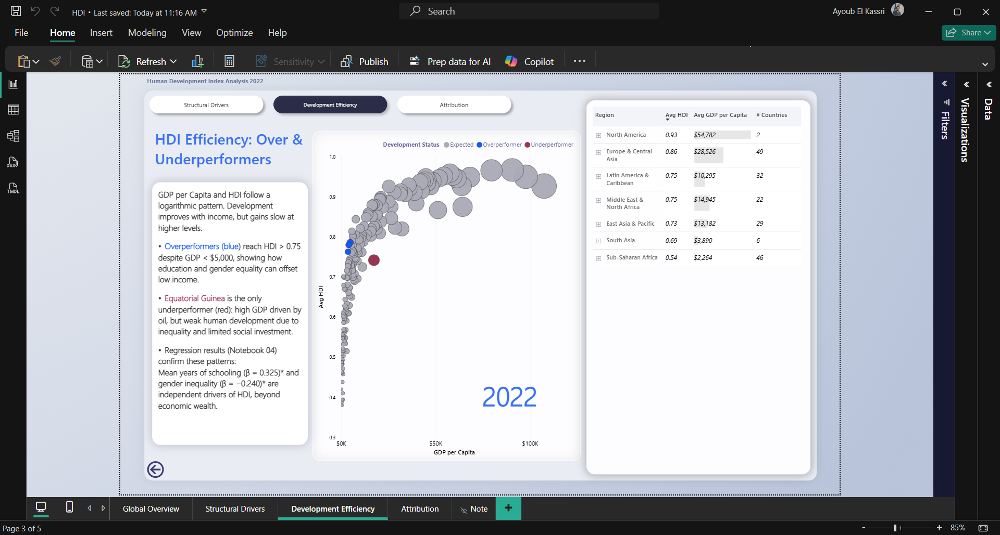

# HDI Cross-Country Analysis (2022)


## Overview

This project demonstrates an end-to-end analytical pipeline using the **Human Development Index (HDI)** as a real-world use case. It integrates data from multiple international sources, standardizes and stores them in a relational database, applies statistical diagnostics, and delivers insights through an interactive dashboard.

The pipeline spans automated API ingestion, multi-source data harmonization, OLS regression for pipeline validation, SQL-based storage and Power BI visualization applied to 186 countries using 2022 data.

---

## Dashboard Preview

### Page 1: Global Overview


### Page 2: Structural Drivers


### Page 3: Development Efficiency


---

## Pipeline Architecture  

| Step | Notebook | Key Actions |
| :--- | :--- | :--- |
| **01** | **Data Acquisition** | Automated fetching of WB (WDI/WGI) and UNDP indicators |
| **02** | **Data Cleaning** | ISO alpha-3 standardisation and schema alignment |
| **03** | **EDA** | Distribution analysis, log-transformations, and proxy validation |
| **04** | **Statistical Analysis** | OLS regression as diagnostic tool for dataset integrity check |
| **05** | **MySQL Data Load** | SQL view design and migration to MySQL for BI consumption |

---

## Project Structure
```
hdi-analysis/
│
├── raw_data/                          # Source files (see Data Sources)
│   ├── worldbank_raw.csv
│   ├── wb_country_metadata_raw.csv
│   ├── undp_hdi_raw.csv
│   ├── undp_gii_raw.csv
│   └── wgi_government_effectiveness_raw.zip
│
├── processed_data/
│   ├── master_dataset.csv             # Final merged dataset (186 countries, 11 variables)
│   ├── std_coef.csv                   # Standardized regression coefficients
│   ├── gii_clean.csv                  # Cleaned Gender Inequality Index data
│   ├── undp_clean.csv                 # Cleaned UNDP HDI data
│   ├── wb_clean.csv                   # Cleaned World Bank indicators
│   └── wgi_clean.csv                  # Cleaned Governance indicators
│
├── notebooks/
│   ├── 01_data_acquisition.ipynb      # API calls, raw data download
│   ├── 02_data_cleaning.ipynb         # Merging, imputation, enrichment
│   ├── 03_eda.ipynb                   # Distributions, correlations, outliers
│   ├── 04_statistical_analysis.ipynb  # Pipeline validation via OLS regression
│   └── 05_load_to_mysql.ipynb         # Load master dataset to MySQL
│
├── sql/
│   ├── 01_analytical_queries.sql      # High/Low 10, overperformers, underperformers
│   └── 02_views.sql                   # v_hdi_overview, v_income_groups, v_development_efficiency
│
├── powerbi/
│   ├── hdi_dashboard.pbix             # Power BI report file
│   ├── build_hdi_map.py               # TopoJSON world map fix script
│   └── HDI_Theme.json                 # Custom Power BI theme
│
├── docs/
│   ├── screenshots/                   # Dashboard screenshots
│   │   ├── page1_global_overview.png
│   │   ├── page2_structural_drivers.png
│   │   └── page3_development_efficiency.png
│   ├── data_dictionary.md             # Variable definitions and sources
│   └── map_customisation.md           # Notes on map visual customisation
│
├── .env.example                       # Credentials template
├── .gitignore
└── README.md
```

---

## Methodological Notes

### Year Selection
2022 was selected as the reference year for three reasons: (1) it is the most recent year with complete coverage across all five data sources; (2) it represents the first post-pandemic normalized year, 2020 and 2021 data are heavily distorted by COVID-19 (GDP contraction, emergency health spending, school closures), making structural inference unreliable; (3) the analysis is intentionally cross-sectional a single-year snapshot designed to illustrate the pipeline functionality not to establish causal relationships over time.

### GDP as a Strategic Proxy
While the official UNDP HDI formula utilizes GNI (Gross National Income), this pipeline employs **GDP per capita (PPP)**.

- **Justification:** GDP provides higher data density across World Bank WDI and WGI sources for the 2022 period, reducing sparsity in the integrated dataset.
- **Validation:** Signal audit confirmed a logarithmic alignment of $r = 0.95$ with HDI (linear $r = 0.72$), validating the log-transformation and confirming GDP per capita as a high-fidelity proxy for structural modeling.

### Pipeline Validation via OLS
Notebook 04 uses OLS regression as a **diagnostic tool** to verify that the relationships between integrated multi-source indicators behave consistently with the known theoretical framework of HDI. The standardized coefficients ($\beta^*$) and significance tests serve as signal integrity checks — confirming that the data pipeline has correctly captured and aligned the economic, educational, and social dimensions of human development across sources. These outputs should be interpreted as **associative diagnostics**, not causal findings.

---

## Illustrative Outputs

The pipeline produces the following associative patterns in the 2022 dataset:

- **Log GDP per capita** ($\beta^* = 0.540$, $p < 0.001$) — strongest signal, with diminishing returns at higher income levels
- **Mean years of schooling** ($\beta^* = 0.325$, $p < 0.001$) — significant positive association
- **Gender Inequality Index** ($\beta^* = -0.240$, $p < 0.001$) — significant negative association
- **Overperformers** — countries achieving HDI > 0.75 despite GDP per capita below $5,000, suggesting that social investment patterns offset economic constraints in specific contexts

> **Note:** These outputs reflect associations within a cross-sectional dataset. Mean years of schooling is partially embedded in the HDI construction, which limits causal interpretation. Results should not be generalised beyond the 186-country sample, which excludes many fragile and conflict-affected states due to data availability constraints.

---

## Variables

| Variable | Description | Source |
|---|---|---|
| `hdi` | Human Development Index (0–1) | UNDP |
| `gdp_per_capita` | GDP per capita, PPP (current intl. $) | World Bank |
| `mean_years_schooling` | Average years of schooling, age 25+ | UNDP |
| `education_expenditure_pct_gdp` | Government education expenditure (% GDP) | World Bank |
| `health_expenditure_per_capita` | Current health expenditure per capita ($) | World Bank |
| `government_effectiveness` | WGI Government Effectiveness score | World Bank |
| `gii` | Gender Inequality Index (0–1, higher = more unequal) | UNDP |
| `region` | World Bank geographic region | World Bank |
| `income_level` | World Bank income classification | World Bank |

**Final dataset:** 186 countries · 11 variables · reference year 2022

---

## Tech Stack & Data Sources

**Stack:** Python (Pandas, Statsmodels, SQLAlchemy), MySQL 8.0, Power BI Desktop.

| Dataset | Source | License |
| :--- | :--- | :--- |
| HDI & Education | UNDP Human Development Reports | CC BY 3.0 |
| Economic & Health Indicators | World Bank WDI | CC BY 4.0 |
| Governance Indicators | World Bank WGI | CC BY 4.0 |
| Gender Inequality Index | UNDP Human Development Reports | CC BY 3.0 |
| Country Metadata | World Bank API | CC BY 4.0 |

---

## Limitations and Future Directions

Like any cross-country HDI analysis, the results are shaped by data availability, measurement differences across countries, and the inherent limitations of OLS — so the outputs should be interpreted as associations rather than causal effects. Six limitations are acknowledged and directly inform future work:

1. **Circularity:** mean years of schooling is partially embedded in HDI construction. Future versions will use the Inequality-adjusted HDI (IHDI) as the target variable with external education proxies.
2. **Cross-sectional design:** single-year data cannot establish causality or track structural change. Version 2 will extend to panel data (2010–2022) with fixed-effects modelling and a pre/post-COVID comparison.
3. **Omitted variables:** conflict status, colonial legacies, urbanisation, and income inequality are not included and will be incorporated in the extended model.
4. **Selection bias:** the 186-country sample excludes fragile and conflict-affected states due to data availability, which limits generalisability.
5. **Ecological fallacy:** all findings are country-level averages that may conceal significant sub-national disparities.
6. **Overperformer thresholds:** classification thresholds are analytically informed but not statistically derived. A sensitivity analysis will be included in version 2.

---

## Setup & Reproduction

### Prerequisites
```
Python 3.11+
MySQL 8.0+
Power BI Desktop (free)
```

### Install dependencies
```bash
pip install pandas numpy matplotlib seaborn statsmodels scipy sqlalchemy mysql-connector-python wbdata openpyxl jupyter
```

### Database setup
```sql
CREATE DATABASE hdi;
```

Copy `.env.example` to `.env` and fill in your credentials:
```
DB_HOST=127.0.0.1
DB_PORT=3306
DB_USER=root
DB_PASSWORD=your_password
DB_NAME=hdi
```

### Run notebooks in order
```
01_data_acquisition.ipynb
02_data_cleaning.ipynb
03_eda.ipynb
04_statistical_analysis.ipynb
05_mysql_data_load.ipynb
```

### Load SQL views
```bash
mysql -u root -p hdi < sql/02_views.sql
```

---

## License

This project is licensed under the MIT License. The underlying datasets retain their original licenses (CC BY 3.0 / CC BY 4.0) — see Data Sources above.

---

## Author

**Ayoub EL KASSRI**
Data Analyst | MEAL Specialist · [LinkedIn](https://www.linkedin.com/in/ayoub-el-kassri-468b2a215/)

*If you find this project useful, a ⭐ on the repo is appreciated.*
